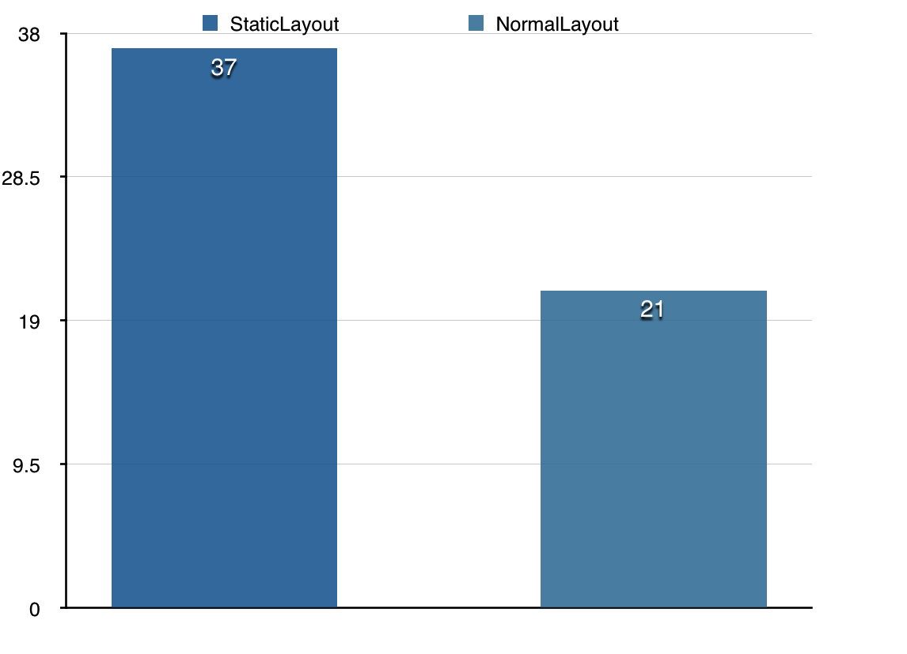

# Adapter最佳实践

**概要：使用Adapter的注意事项与优化方案**  
本文的例子都可以在结尾处的示例代码连接中看到并下载，如果喜欢请star，如果觉得有纰漏请提交issue，如果你有更好的点子可以提交pull request。  
本文的示例代码主要是基于[CommonAdapter][1]这个库编写的，若你有其他的技巧和方法可以参与进来一起完善这篇文章。  
固定连接：[https://github.com/tianzhijiexian/Android-Best-Practices/blob/master/2015.10/adapter/adapter.md][2]  

### 一、背景   
故事发生在一个月黑风高的夜晚，那时候我知道了android世界中的一个恐怖的存在————adapter。看着无数的精英们随意地使用这强大的武器，造就了很多美轮美奂的应用时，我就暗自发誓，我一定要获得这个利器！  
通过自身不断的修行，我慢慢的发现，那些系统提供的adapter没太大作用，仅仅在我写demo时才会去图省事用一用（确实挺省事的）。而在实际的开发中，我一直都在用baseAdapter。正所谓万变不离其宗，有了baseAdapter后，我就拥有了七十二变化，杀得了白骨精，斗得过二郎神，完全可以搞定设计和产品提出的需求。    

    

直到有一天，当我看到一个包含着四五种类型，有着不同交互的item的Adapter后，一种苍白的无力感紧紧的抓住了我，我没办法一下子了解其中的所有的逻辑，在上面进行优化和添加需求都很痛苦。在一团乱麻的代码中，任何优化方案和设计模式都变得没有意义，我只能一边吐槽一边在上面写着让其更加恶心和难以维护的代码。

**转折**   

后来，当我教我的学弟适配器方面的内容时，我说出了上面的经历。之后他的话让我陷入了深深的沉思之中。  
“adapter到底是view还是controler呢？”他说。我沉默良久，却不能给出一个回答。  
是啊，adapter这个概念看似简单，但却模糊不清，于是我开始寻找这个问题的答案。 终于在菩提树下沉思三天三夜后，得出了以下答案：   

1. adapter既不是v也不是c  
2. adapter就是一个数据和视图的绑定装置  
3. 数据、视图、绑定器三者的代码不应该缠在一起    

思考过后，我就开始进行adapter的研究，希望最后完成一个库来的进行调用。  

### 二、需求  
1. 数据不应知道adapter和view的存在 
2. Adapter不应该成为一个独立的类，而是fragment、activity中的内部类   
3. Adapter能支持多种item类型，能仅改动几行代码即可添加一个新的item    
4. Adapter能对自身内部的item进行复用，不需要我们手动判断convertView是否为null   
5. Adapter中对findviewById方法应该有优化，类似于ViewHolder   
6. item能独立的处理自身的逻辑和点击事件，自身应具有极高的独立性和可维护性   
7. item自身的setListener应仅设置一次，而不用在getView时重复建立  
8. Adapter应该提供item的局部刷新功能    
9. Listview的adapter应该在稍微修改后支持recyclerView，方便未来的过渡

**和适配器不太相关的需求：**  
1. 如果item中要加载网络或本地图片，请在线程中加载，加载好后切回主线程显示  
2. 在快速滑动时不加载网络图片或停止gif图的播放  
3. 判断item已经显示的数据和需要显示的新数据是否不同，如果不同就更新，否则不更新   
4. 如果一个item过于复杂，可以将其拆分成多个小的item  
5. 如果item中文本过多，可以采用textview的预渲染方案  
6. 如果发现item因为measure任务过重，而出现掉帧，则需要通过自定义view来优化此item。这种方案适用于，某个item在应用中频繁使用的情形。   

### 三、解决方案    

**1. 数据应不知道对adapter和view的存在**    

view肯定需要知道设置给自己的数据是什么，adapter肯定要知道view和数据是什么，但数据应该对其他的东西完全不知情。   

数据的傻瓜化的好处有很多，如果这么做了，我们甚至可以把网络层和解析的model放入java项目中，利用java工程的特性进行网络层快速的单元测试（这点在以后的文章中可能会涉及）。在这次的说明中，我们建立这样一个超级简单的数据模型：
```JAVA
public class DemoModel {

    public String content;

    public String type;

    /**
     * 这个model中决定数据类型的字段
     */
    public Object getDataType() {
        return type;
    }

}
```  
它就是一个POJO，没有任何特别之处，它完全不知道其他对象的存在。   


**2. Adapter是内部类**   

回看我们之前写的代码，经常会把adapter中写入很多逻辑和判断的语句，现在如果想要让adapter变成一个仅仅用于与视图进行绑定的简单工具，那么它里面就不应该有不属于它的操作，它应该仅仅做到的是接收数据，然后绑定视图。因此，将其作为内部类是完全可行的，并且还会增加可读性。就像下面这样：
```JAVA
listView.setAdapter(new CommonAdapter<DemoModel>(data) {
    @Override
    public AdapterItem<DemoModel> getItemView(Object type) {
        return new TextItem();
    }
});
```   
**注意：** 

>可以在初始化listview后直接设置adapter，给adapter传入一个初始化后的空list。在得到数据之后，通过更新数据再填入新数据。这样的思路来自于空对象的技巧，防止出现getAdapter为null的情况，多了一个对象，但是少做了很多判断，也间接减少了维护的难度。  

这个通用的适配器接收了data，然后在getItemView的时候返回想要的item对象。需要说明的是，data的类型是`list<T>`，用来适应各种类型的数据源。这里的item对象，等会咱们再谈，先来看看如果是多种类型item该咋办。  
  
  
**3. Adapter能支持多种item类型**   

```JAVA
listView.setAdapter(new CommonAdapter<DemoModel>(data, 3) {

    @Override
    public Object getItemViewType(DemoModel demoModel) {
        return demoModel.getDataType();
    }
    
    @Override
    public AdapterItem<DemoModel> getItemView(Object type) {
        switch ((String) type) {
            case "text":
                return new TextItem();
            case "button":
                return new ButtonItem();
            case "image":
                return new ImageItem();
            default:
                return new TextItem();
        }
    }
});
```   
在这个例子中，我们可以看到它能支持3种类型的item。只不过需要在构造方法中传入data和item的种类。并且实现getItemViewType这个方法，这个方法用来返回model中用来做判断的类型参数。    

如果对比第二点的单个类型的适配器代码看来，从上面的代码改到现在的代码，只需要**增加（注意：这里不是修改）**短短几行代码，而不是像以前那样又要修改适配器又要修改getView的方法体。通过“增加”代码的方式来扩展需求比通过“修改”代码扩展需求要稳定和安全很多，因为不会动原有的逻辑。如果来了新的需求，让你多支持一个item类型，你只需要在switch-case语句块中新增一个case就行，简单且安全。   

**注意：**
>在做这样的操作时，请务必写上`default`这个条件，以免出现不可预知的错误。毕竟来自服务器的数据也是不能完全相信的。   
    
    
**4. Adapter能对自身内部的item进行自动复用**    

我们之前对adapter的优化经常是需要在getView中判断convertView是否为null，如果不为空就不new出新的view，这样来实现item复用。但我们的目的是希望这个库能帮我们自动化的做到这点，于是赶快看看上面已经出现多次的`AdapterItem`是个什么东西吧。  
```JAVA
/**
 * adapter的所有item必须实现此接口.
 * 通过返回{@link #getLayoutResId()}来自动初始化view，之后在  
 * {@link #onBindViews(View)}中就可以初始化item的内部视图了。<br>
 */
public interface AdapterItem<T> {

    /**
     * @return item布局文件的layoutId
     */
    @LayoutRes
    int getLayoutResId();

    /**
     * 初始化views
     */
    void onBindViews(final View root);

    /**
     * 设置view的参数
     */
    void onSetViews();

    /**
     * 根据数据来设置item的内部views
     *
     * @param model    数据list内部的model
     * @param position 当前adapter调用item的位置
     */
    void onUpdateViews(T model, int position);

}  
```  
看到这我不禁失望了起来，这是什么鬼！一个接口，没啥东西的接口。当我冷静下来，开始思考这个接口有什么用，反正我不知道它和复用item有什么关系。  

它就像一个表格：   

时机|人话|做的工作
--- | --- | ---
getLayoutResId|你这个item的布局文件是什么| 返回一个R.layout.xxx
onBindViews|在这里做findviewById的工作吧| btn = findViewById(R.id.xx)
onSetViews|在这里初始化view各个参数吧| setcolor ,setOnClickListener...
onUpdateViews|数据更新时会调用（类似getView）|button.setText(model.text)   

其实这里就是适配器中view的几个过程，首先初始化布局文件，然后绑定布局文件中的各个view，接着进行各个view的初始化操作，然后在数据更新时在updateViews中进行更新数据的操作。  
分析完毕后，我去源码里面翻了一下，终于发现了这个库对item复用的优化：
```JAVA
LayoutInflater mInflater;

@Override
public View getView(int position, View convertView, ViewGroup parent) {
    // 不重复创建inflater对象，无论你有多少item，我都仅仅创建一次
    if (mInflater == null) {
        mInflater = LayoutInflater.from(parent.getContext());
    }
    
    AdapterItem<T> item;
    if (convertView == null) {
        // 当convertView为null，说明没有复用的item，那么就new出来
        item = getItemView(mType);
        convertView = mInflater.inflate(item.getLayoutResId(), parent, false);
        convertView.setTag(R.id.tag_item, item);
        // 调用bindView进行view的findview。
        // 可以看到仅仅是新new出来的view才会调用
        item.onBindViews(convertView); 
        // findview后开始setView。将绑定和设置分离，方便整理代码结构
        item.onSetViews(); 
    } else {
        // 如果这个item是可以复用的，那么直接返回
        item = (AdapterItem<T>) convertView.getTag(R.id.tag_item);
    }
    // 无论你是不是复用的item，都会在getView时触发updateViews方法，更新数据
    item.onUpdateViews(mDataList.get(position), position);
    return convertView;
}
```   
通过上面的注释得出，这个库自动帮我们做了很多优化，我们只需在对应的方法中写上对应的语句即可。   

这个库最根本的方法就是这一段，所以你只需要明白这一段代码做的事情，即使你以后在使用这个库时遇到了什么问题，你都可以不必惊慌，因为你掌握了它的原理。其实用不用一个第三方库我有下面的几点建议：   

1. 如果你不了解其内部的实现，那么尽可能少用。因为出了问题无从查找    
2. 如果你遇到一个很好的库，不妨看下内部的实现，既能学到东西，又可以在以后出问题的时候快速定位问题   
3. 如果遇到复杂的库，比如网络和图片库。全部知道其原理是很难的，也需要成本，而你自己写也是不现实的，所以需要挑选很有名气的库来用。这样即使遇到了问题，也会有很多资料可以搜到   
4. 不要抵触国人的库，国人的库更加接地气，说不定还更好，还可以更加方便的提出issue。我就觉得AndroidEventBus就写的挺好的！  

**5. Adapter中对findviewById方法应该有优化，类似ViewHolder**     

这点在第四点中我已经进行了详细的说明和分析，我们只需要在bindViews中写findview方法即可让这个库自动实现优化工作。我在实际使用中结合了databinding这个库进行编写，一行代码解决问题：
```JAVA
    private DemoItemImageBinding b;

    @Override
    public void onBindViews(View root) {
        b = DataBindingUtil.bind(root);
    }
```  
传统的话就是这样：
```JAVA
    TextView textView;

    @Override
    public void onBindViews(View root) {
        textView = (TextView) root.findViewById(R.id.textView);
    }
```   
我强烈建议使用dataBinding做视图的绑定操作，因为它自动化程度很高，再也不用看到findviewById这种方法了。而且当你更改了view的id或者类型，它也会自动识别，大大增加了可维护性。   
目前我看到它对于mvvm的支持力度在idea层面遇到了无法进行代码提示的问题，所以我不建议将其用于视图绑定之外的数据绑定上。  

**6. item能独立的处理自身的逻辑和点击事件，自身应具有极高的独立性**    

举个例子，你的item就是一个textView：
```XML
<?xml version="1.0" encoding="utf-8"?>
<layout xmlns:android="http://schemas.android.com/apk/res/android">

    <TextView
        android:id="@+id/textView"
        android:layout_width="match_parent"
        android:layout_height="wrap_content"
        android:layout_gravity="center_horizontal"
        android:gravity="center"
        android:text="New text"
        android:textSize="30sp"
        />
</layout>
```  
现在item类应该这么写：
```JAVA
public class TextItem implements AdapterItem<DemoModel> {

    public int getLayoutResId() {
        return R.layout.demo_item_text;
    }

    TextView textView;

    public void onBindViews(View root) {
        textView = (TextView) root.findViewById(R.id.textView);
    }

    public void onSetViews() {}

    public void onUpdateViews(DemoModel model, int position) {
        textView.setText(model.content);
    }

}
```   
这个item对于被哪个适配器绑定是不知情的，各个数据的更新应该全部由自己完成。现在，你可以将它放入不同的界面，只需要给他同样的数据模型即可。当然，我知道这种一个item被多个页面用的情形中还可以做更多的优化，比如在RecyclerView设置全局的缓存池等等。   

**注意：**  

>我强烈建议不要用itemOnListener做点击的判断，而是在每个item中做判断。这样的好处就是item自身知道自己的所有操作，而listview仅仅做个容器。现在RecyclerView的设计思路也是如此的，让item独立性增加，也更加符合我们现实生活中的逻辑。     
我们生活中的认知是这样的：这个列表中支持普通的微博和官方推荐的广告，如果用户点了普通的微博则进入微博，如果点了广告就进入广告页面。所以点击的是微博还是广告应该是自己判断的，而不是交给容器来做。  
    
**7. item自身的setListener应仅设置一次，不用在getView时重复建立**   

上面也说到了，我们之前会图省事在listview的getView中随便写监听器，以至于出现了监听器爆炸的现象。现在，我们在setViews中写上监听器，这样就只建立需要的监听器对象，降低资源的浪费。  
```JAVA
/**
 * @tips
 * 优化小技巧：这个就等于一个viewHolder，用于复用，所以不会重复建立对象
 */
public class ButtonItem implements AdapterItem<DemoModel> {

    private int mPosition;

    @Override
    public int getLayoutResId() {
        return R.layout.demo_item_button;
    }
    
    private DemoItemButtonBinding b;

    @Override
    public void onBindViews(final View root) {
        b = DataBindingUtil.bind(root);
    }

    /**
     * @tips
     * 优化小技巧：在这里直接设置按钮的监听器。
     * 因为这个方法仅仅在item建立时才调用，所以不会重复建立监听器。
     */
    @Override
    public void onSetViews() {
        // 这个方法仅仅在item构建时才会触发，所以在这里也仅仅建立一次监听器，不会重复建立
        b.button.setOnClickListener(new View.OnClickListener() {
            @Override
            public void onClick(View v) {
                Toast.makeText(b.getRoot().getContext(), "pos = " + mPosition, Toast.LENGTH_SHORT).show();
            }
        });
    }

    @Override
    public void onUpdateViews(DemoModel model, int position) {
        // 在每次适配器getView的时候就会触发，这里避免做耗时的操作
        mPosition = position;
        b.button.setText(model.content);
    }

}  
```  
**8. Adapter应该提供item的局部刷新功能**    

这个功能在recyclerView中就已经提供了，我就不废话了。推荐直接使用recyclerView来做列表。在react-native的源码中我也看到了对recyclerView的支持。网上流传比较多的是用下面的代码做listview的单条刷新：
```JAVA
private void updateSingleRow(ListView listView, long id) {  
  
        if (listView != null) {  
            int start = listView.getFirstVisiblePosition();  
            for (int i = start, j = listView.getLastVisiblePosition(); i <= j; i++)  
                if (id == ((Messages) listView.getItemAtPosition(i)).getId()) {  
                    View view = listView.getChildAt(i - start);  
                    getView(i, view, listView);  
                    break;  
                }  
        }  
    }  
```  
其实就是手动调用了对应position的item的getView方法，个人觉得不是很好，为何不直接使用recyclerView呢？  

**9. Listview的adapter应该在稍微修改后支持recyclerView**   

如今recyclerView大有接替listview的趋势，我们自然要关心如何从的listview的适配器切到recyclerView的适配器。要知道listview的适配器和recyclerView的适配器的写法是不同的。  
上面给出的例子都是listview的写法，我在这里在引用一下：
```JAVA
listView.setAdapter(new CommonAdapter<DemoModel>(data) {

    @Override
    public AdapterItem<DemoModel> getItemView(Object type) {
        return new TextItem();
    }
});
```   
换成recyclerView的适配器应该需要改很多步吧？  
不！不要998，不要98，改一行代码早回家~  
```JAVA
recyclerView.setAdapter(new CommonRcvAdapter<DemoModel>(data) {

    public AdapterItem<DemoModel> getItemView(Object type) {
        return new TextItem();
    }
});
```  
注意到了么，就换了一个适配器的类名和容器名，其余的都没变，这才是我们想要的！  

### 四、解决和Adapter不太相关的需求

**1. 如果item中要加载图片，请在线程中加载，加载好了后切回主线程显示**    

有了RxAndroid这都不是事，当然一般的图片框架也会做这点。如果你使用的图片框架中没有做这样的处理，请务必加上！ 

**2. 在快速滑动时不加载网络图片或停止gif图的播放**    

这个在QQ空间和微信朋友圈详情页中很常见，这个工作我仍旧希望交给图片加载框架做，而不是手动处理。因为手动处理对程序员的懒惰程度和知识水平有要求，所以还是交给库做放心。如果你的库没有做这样的处理，可以参考[Android-Universal-Image-Loader][3]中的实现方法。  
核心代码：
```JAVA
@Override
	public void onScrollStateChanged(AbsListView view, int scrollState) {
		switch (scrollState) {
			case OnScrollListener.SCROLL_STATE_IDLE:
				imageLoader.resume();
				break;
			case OnScrollListener.SCROLL_STATE_TOUCH_SCROLL:
				if (pauseOnScroll) {
					imageLoader.pause();
				}
				break;
			case OnScrollListener.SCROLL_STATE_FLING:
				if (pauseOnFling) {
					imageLoader.pause();
				}
				break;
		}
		if (externalListener != null) {
			externalListener.onScrollStateChanged(view, scrollState);
		}
	}
```  
**3. 判断item已有的数据和新数据是否不同**    

如果是加载图片，我还是希望你去看看你用的图片框架有没有做这样的优化，如果有就请放心，如果没有，那么请自己在框架中配置或者写工具类。   

这里的情况不仅仅适用于图片也适用于其他的数据，如果你的item中文字很多，经常有几百个文字。那么也可以先判断要显示的文字和textview中已经有的文字是否一致，如果不一致再调用setText方法。下面是一个例子：
```JAVA
/**
     * @tips 优化小技巧：对于图片这样的对象，我们先判断要加载的图片是不是之前的图片，如果是就不重复加载了
     * 这里为了演示方便没从网络加图，所以url是用int标识的，一般情况下都是用string标识
     * 
     * 这里仅仅是用图片做个说明，你完全可以在textview显示文字前判断一下要显示的文字和已经显示的文字是否不同
     */
    @Override
    public void updateViews(DemoModel model, int position) {
        if (b.imageView.getTag() != null) {
            mOldImageUrl = (int) b.imageView.getTag();
        }
        int imageUrl = Integer.parseInt(model.content);
        
        if (mOldImageUrl == 0 && mOldImageUrl != imageUrl) {
            Log.d(ImageItem.class.getSimpleName(), "update image--------->");
            b.imageView.setTag(imageUrl);
            
            b.imageView.setImageResource(imageUrl); // load local image
        }
    }
```  
**4. 如果一个item过于复杂，可以将其拆分成多个小的item**   

关于这点是facebook提出的优化技巧，后来我了解到ios本身就是这么做的。我会找机会了解一下ios的实现机制，然后看看能不能放入这个库里面，方便android们使用。  

如图所示，这个item很复杂，而且很大。当你的item占据三分之二屏幕的时候就可以考虑这样的优化方案了。右图说明了将一个整体的item变成多个小item的效果，在这种拆分后，你会发现原来拆分后的小的item可能在别的界面也用到了，可以在写其他需求的时候也用一下，这就出现了item模块化的思想，总之是一个挺有意思的优化思路。   

详细的文章（中文）请参考：[facebook新闻页ListView的优化方案][4]，十分感谢作者的分享和翻译~  

**5. 如果item中文本过多，可以采用textview的预渲染方案**  
如果你是做bbs或者做新闻的，你会发现item中会有大量的文字。textview其实是一个很基本但不简单的view，里面做了大量的判断和处理。当你有心想要优化textview的时候，你会发现在我们知道这个item中textview的宽度和文字大小的情况下可以把初始化的配置做个缓存，每个textview只需要用这个配置好的东西进行文字的渲染即可。   

Instagram（现已在facebook旗下）分享了他们是如何优化他们的TextView渲染的效率的，在国内有作者也专门写了一篇文章来说明实际的原理和最终的效果，[文章短小精悍，值得一读][5]。  
我之后在github上问他后续的工作安排，他回答到准备做好一个优化textview的库并放出，希望到时候能帮助到大家。  
下面是通过优化得到的结果：

> 这里测试的机器是MX3，左侧是直接使用StaticLayout的方案，右侧是系统的默认方案，Y轴是FPS，可以看出来，使用优化之后的方案，帧率提升了许多。  


**6. 通过自定义viewGroup来优化item，从而减少重复的measure**    


facebook的工程师讲解了他们对上面这个布局的优化策略，内容翔实，是个很好的分享。中文翻译版本：[听FackBook工程师讲Custom ViewGroups][6]   


### 五、总结  
感谢大家阅读到最后，请在阅读的时候多多留心文章中穿插的注意事项。如果你有其他的优化适配器和列表控件的方法也请多多指出，如果你觉得这个库不错，请去尝试。   

最后要来说下自己对adapter的理解：   
1. adapter仅仅作为一个数据和item的绑定器，不属于v也不是c，类似一个工具类。   
2. item是v，并且应该和activity，fragment共用一个v的标准。比如都有onBindViews()，setViews()等类似的方法。    
3. 接下来说item作为一个独立的对象后怎么和adapter进行通信。如果你用commonAdapter了，那么item就是一个普通类，你可以传入activity对象。    
4. 如果你的item没有复用价值（刚开始写肯定没复用价值），那么你可以传入特定的activity做参数，然后你调用那个activity中的public方法即可。  
5. 如果你的item在后面慢慢会被复用了，那么你可以让复用这个item的多个activity实现同一个接口，传入接口对象，进行调用其public方法。   
6. 更加复杂的情况是，如果你的item被复用了，而且每个activity对其的要求不同，比如activity01需要监听item中View01点击事件，activity02需要获得view02的高度这样的。在这种复杂的情况下，你可以考虑用eventBus做通信。   

探索无止境，优化没底线，我还是希望能有库在库中做好很多的优化操作，降低对程序员的要求，最终希望谁都可以写代码。简单编程，快乐生活。    

本文的完成离不开朋友们的支持和帮助，感谢：@MingleArch、豪哥的批评和建议。

示例代码下载：https://github.com/tianzhijiexian/CommonAdapter
  
  
     
     
### 作者  
     

developer_kale@.qqcom  
@天之界线2010

参考文章：  
[http://www.cnblogs.com/tianzhijiexian/p/4278546.html][7]


  [1]: https://github.com/tianzhijiexian/CommonAdapter
  [2]: https://github.com/tianzhijiexian/Android-Best-Practices/blob/master/2015.10/adapter/adapter.md
  [3]: https://github.com/nostra13/Android-Universal-Image-Loader/blob/master/library/src/main/java/com/nostra13/universalimageloader/core/listener/PauseOnScrollListener.java
  [4]: http://blog.aaapei.com/article/2015/02/facebookxin-wen-ye-listviewyou-hua
  [5]: http://ragnraok.github.io/textview-pre-render-research.html
  [6]: http://www.devtf.cn/?p=515
  [7]: http://www.cnblogs.com/tianzhijiexian/p/4278546.html
