# UI实时预览最佳实践

**概要：Android中实时预览UI的各种技巧。**  
本文的例子都可以在结尾处的示例代码中看到并下载。如果喜欢请star，如果觉得有纰漏请提交issue，如果你有更好的点子可以提交pull request。  
本文的代码主要是基于作者的实际经验编写的，如果你有其他的技巧和方法也可以参与进来一起完善此文。
文章固定连接：[https://github.com/tianzhijiexian/Android-Best-Practices/blob/master/2015.9/ui/ui.md](https://github.com/tianzhijiexian/Android-Best-Practices/blob/master/2015.9/ui/ui.md)

### 一、啰嗦  
之前有读者反馈说，你搞这个所谓的最佳实践，每篇文章最后就给了一个库，感觉不是很高大上。其实，我在写这个系列之初就有想过这个问题。我的目的是：给出最实用的库来帮助我们开发，并且尽可能地说明这个库是如何编写的，希望让初创公司的程序员少写点给后人留坑的代码（**想必大家对此深有体会**）。  
我之前给出的库都是很简单基础的，基本是一看就懂（*但足够精妙*），如果以后的文章涉及到了复杂的库，我会专门附加一篇库的讲解文。  
如果一个库的原理你知道，此外这个库很容易扩展和维护，而且它还用到了很多最佳实践的经验，你为什么不去试试呢？程序的意义在于把前人的优秀思维和丰富经验记录下来，让使用者可以轻易地站在巨人的肩膀上。它的意义甚至堪比于将祖先的智慧通过DNA遗传给我们，它是一种颠覆性的存在。如果我仅仅是分享自己在实践中获得的很多经验，这就不是程序，而是教育！  
令人遗憾的是，我只能将很多有章可循的东西包装为库，而调试UI这种杂乱无章的技巧只能通过文章来记录，故产生了此文。

### 二、需求  
有很多初学者都听到前辈们说Android Studio（下文简称为as）的布局实时预览很强大，但是当我们真正使用as后就会发现很多界面在预览时是这样的：
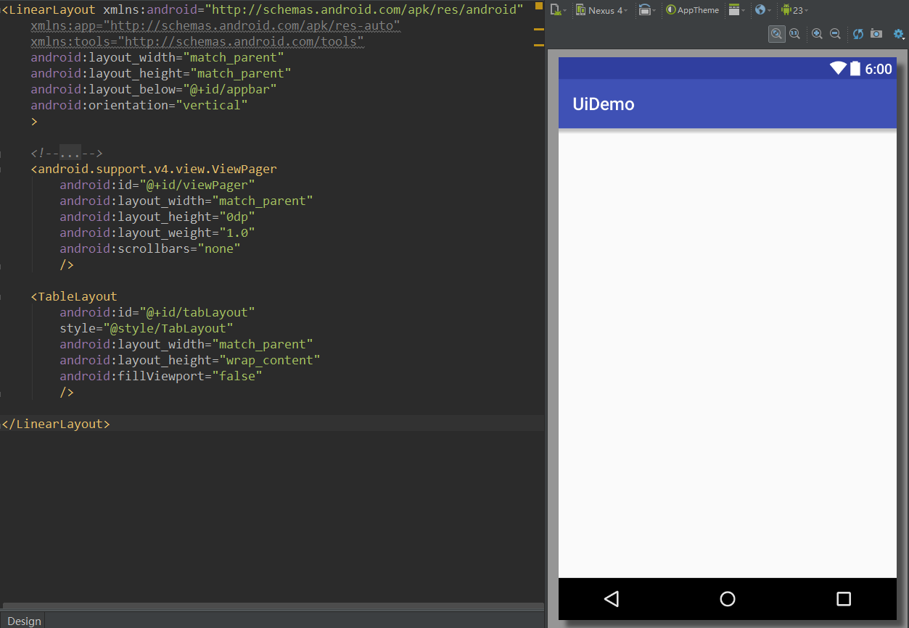
或者这样的：  
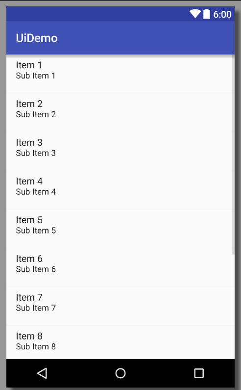  
甚至是这样的：  
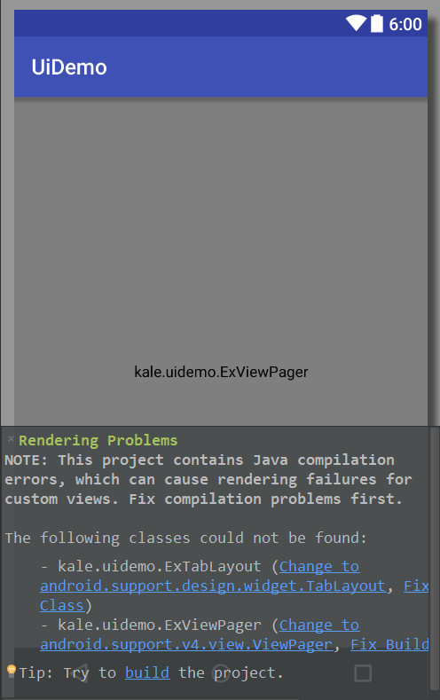  
这时候谁再和我讲as可以让你实时地编写UI，我就要和谁拼命了。(┬＿┬)  
其实这个不是as的错，而是开发者（包括google的开发人员）的错。因为很多开发者不注重实时的ui显示，一切都是以真机运行的结果做评判标准，从而产生了很多无法预览，但能运行的界面。在很多项目中，一个原本可以一秒内看到的效果，最终需要漫长的过程（编译->运行->安装->显示）才能被我们看到。我不得不说这是反人类的，大大降低了Android程序员的开发效率，破坏了开发的心情（**我是很注重开发心情的**），让as强大的预览功能变得形同虚设。那么，下面就来说说如何让自己的UI可实时调试的方案和技巧。   

### 三、技巧  
**3.1 少用merge标签**  
很多文章都说为了避免层级加深请用merge标签，但是我这里却说少用它。原因有两点：
1. merge标签会让布局中各个元素的关系错乱，无法准确的显示ui位置（预览时)。
2. 在merge标签中会失去as自动的代码提示功能，让编写变得困难。  
这两点对于UI的实时预览是极为致命的，所以推荐先用linearLayout等viewgroup做根布局，等编写完毕了后再用merge来代替。我倒不是说merge标签不好，merge标签的设计思路是很棒的，我只是想指出其问题。可惜的是，这两个问题目前没什么其他的好的解决方案了，只能等官方改进IDE和增加tools的功能吧。  
**【吐槽】**  
一个很棒的merge标签被这两个因素弄的很别扭，真是令人伤心，和它同病相怜的还有tools这个命名空间。

**3.2 多用tools的属性**  
`xmlns:tools="http://schemas.android.com/tools"`是一个很重要也是很好用的命名空间，它拥有`android：`中所有的属性，但它标识的属性仅仅在预览中有效，不会影响真正的运行结果。  
举个例子：
```xml
    <TextView
        android:text="Footer"
        android:layout_width="wrap_content"
        android:layout_height="100dp"
        />
```   
这是我们之前的一个写法，把textView的text属性用`android：`来标识。如果我们希望这个textview的文字在代码中实时控制，默认是没文字怎么办？这就需要`tools`的帮助了。
```xml
<TextView
        tools:text="Footer"
        android:layout_width="wrap_content"
        android:layout_height="100dp"
        />
```  
把第一行的`android`替换为`tools`这样既可以能在预览中看到效果，又不会影响代码实际运行的结果。因为在实际运行的时候被`tools`标记的属性是会被忽略的。你完全可以理解为它是一个测试环境，这个测试环境和真实环境是完全独立的，不会有任何影响。  

**【吐槽】**  
tools标签不支持代码提示，而且自己的属性也不能提示，全是靠自己记忆，或者先用android来代替，然后替换android为tools。这么长时间以来，google貌似一直没管它，这也印证了google程序员也是不怎么爱实时预览布局的人。

**3.3 用tools来让listview支持实时预览**  
在之前的代码中，我们总是这样写listview，然后脑补一下item放入的样子。  
```XML
<?xml version="1.0" encoding="utf-8"?>
<ListView xmlns:android="http://schemas.android.com/apk/res/android"
    android:layout_width="match_parent"
    android:layout_height="match_parent"
    />
```
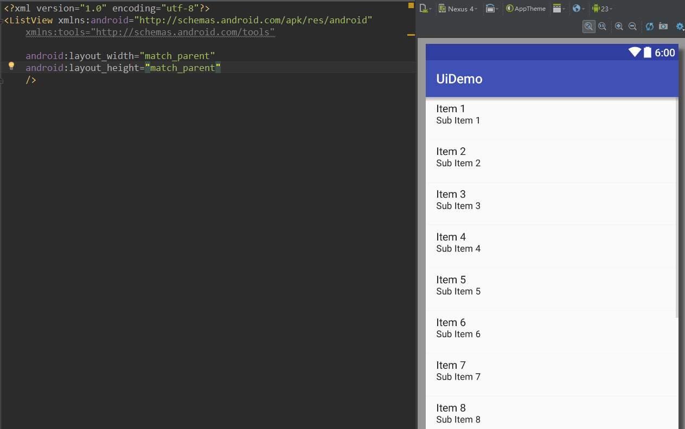  
现在我们可以利用`tools`来预览item被放入的样子了，就像这样：  
```XML
<?xml version="1.0" encoding="utf-8"?>
<ListView xmlns:android="http://schemas.android.com/apk/res/android"
    xmlns:tools="http://schemas.android.com/tools"
    android:layout_width="match_parent"
    android:layout_height="match_parent"
    tools:listheader="@layout/demo_header"
    tools:listitem="@layout/demo_item"
    />
```  
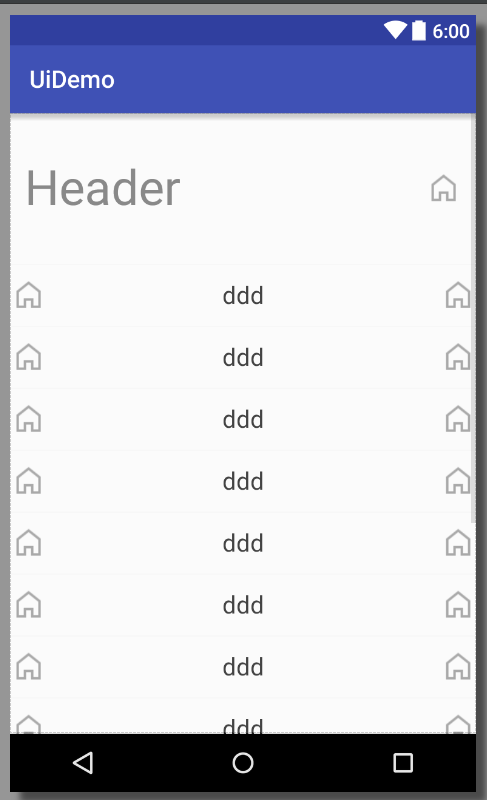    
是不是好了很多呢。   
利用tools的这两个属性可以让我们不用盲写UI了，也可以给设计一个很直观的展示。  

**3.4 利用drawableXXX属性来做有图文的控件**   
textview和其子类都拥有`drawableLeft`、`drawableRight`等属性，通过这些属性可以让我们很方便的做出有图文控件。`drawablePadding`可以设置图文之间的间距，但可惜没有drawableLeftPadding之类的属性。
比如我们要做一个两边有icon，文字居中的控件：   
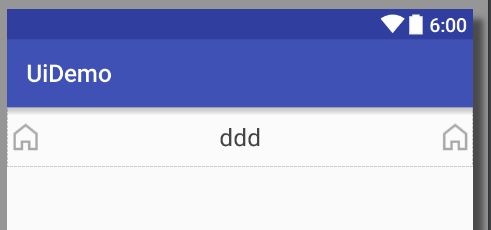  
```XML
<?xml version="1.0" encoding="utf-8"?>
<TextView xmlns:android="http://schemas.android.com/apk/res/android"
    xmlns:tools="http://schemas.android.com/tools"
    android:layout_width="match_parent"
    android:layout_height="50dp"
    android:textAppearance="?android:attr/textAppearanceListItemSmall"
    android:gravity="center_vertical|center_horizontal"
    android:drawableLeft="@drawable/demo_tab_home_selector"
    android:drawableRight="@drawable/demo_tab_home_selector"
    android:drawablePadding="10dp"
    android:text="ddd"
    android:textSize="20sp"
    />
```  
这时如果想调整文字位置，只需要修改`gravity`的值即可。  
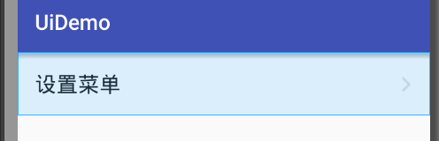  
我们常见的这种（文字+箭头）的控件就可以按照如下方式进行制作：  
```XML
<?xml version="1.0" encoding="utf-8"?>
<TextView xmlns:android="http://schemas.android.com/apk/res/android"
    xmlns:tools="http://schemas.android.com/tools"
    android:layout_width="match_parent"
    android:layout_height="60dp"
    android:padding="16dp"
    android:textAppearance="?android:attr/textAppearanceListItemSmall"
    android:gravity="center_vertical"
    android:drawableRight="@drawable/icon_arrow"
    android:drawablePadding="10dp"
    android:text="设置菜单"
    android:textSize="20sp"
    />
```  

**3.5 利用space和layout_weight做占位**    
有时候我们的需求很复杂，希望一个linearLayout中多个控件分散于两边，因为linearLayout内部的控件只能按照顺序依次排列，想要完成这个效果要用到`space`了。  
```XML
<?xml version="1.0" encoding="utf-8"?>
<LinearLayout xmlns:android="http://schemas.android.com/apk/res/android"
    android:layout_width="match_parent"
    android:layout_height="match_parent"
    android:orientation="horizontal"
    android:gravity="center_vertical"
    android:padding="12dp"
    >

    <TextView
        android:layout_width="wrap_content"
        android:layout_height="100dp"
        android:gravity="center"
        android:text="Header"
        android:textSize="40sp"
        />
    
    <Space
        android:layout_width="0dp"
        android:layout_height="wrap_content"
        android:layout_weight="1"
        />
    
    <ImageView
        android:layout_width="wrap_content"
        android:layout_height="wrap_content"
        android:src="@drawable/tab_icon_home"
        />

</LinearLayout>
```    
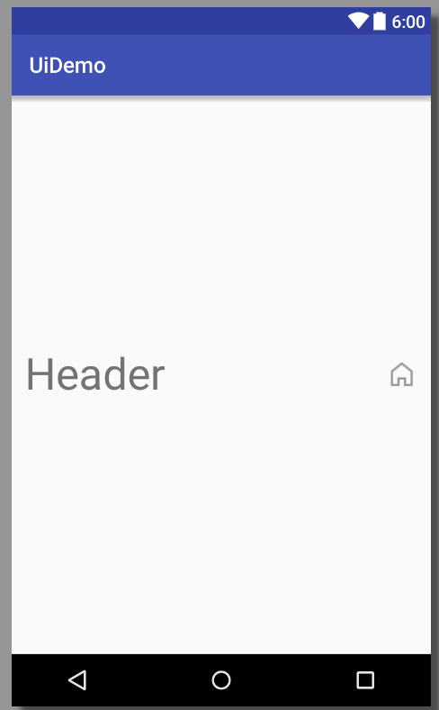   

再举个常见的例子：  
我们要做一个上面是viewpager，底部是tab栏的主页面。这种页面如果仅仅用linearLayout是没办法做的，但如果用了`layout_weight`就可以很方便的完成。
```XML
<LinearLayout xmlns:android="http://schemas.android.com/apk/res/android"
    xmlns:app="http://schemas.android.com/apk/res-auto"
    android:layout_width="match_parent"
    android:layout_height="match_parent"
    android:orientation="vertical"
    >

    <kale.uidemo.ExViewPager
        android:id="@+id/viewPager"
        android:layout_width="match_parent"
        android:layout_height="0dp"
        android:layout_weight="1.0"
        />

    <kale.uidemo.ExTabLayout
        android:id="@+id/tabLayout"
        android:layout_width="match_parent"
        android:layout_height="wrap_content"
        />
    

</LinearLayout>
```  
关键代码：
```XML
    android:layout_height="0dp"
    android:layout_weight="1.0"
```  
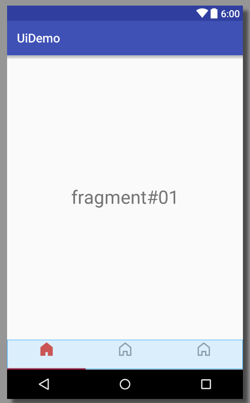  

**3.6 修改原生控件来支持实时预览**   
上面也说到了，很多Android的原生控件都没为实时预览做优化，更不要说第三方的了。在最近的项目中我就遇到了用tabLayout做主界面tab栏的需求。但是google设计的tablayout的耦合性太高了，它依赖于一个viewpager，而viewpager又依赖于adapter，adapter又依赖于数据。所以完全没办法独立调试一个tablayout的样子。因此，我修改了它的代码，让其支持了布局的实时预览。主要就是加入了下面这段代码：
```JAVA
private void preview(Context context, TypedArray a) {
        final String tabStrArr = a.getString(R.styleable.ExTabLayout_tools_tabStrArray);

        final String[] tabRealStrArr = getTabRealStrArr(tabStrArr);
        ViewPager viewPager = new ViewPager(context);

        viewPager.setAdapter(new PagerAdapter() {
            @Override
            public int getCount() {
                return tabRealStrArr.length;
            }

            @Override
            public boolean isViewFromObject(View view, Object object) {
                return view == object;
            }

            @Override
            public CharSequence getPageTitle(int position) {
                return tabRealStrArr[position];
            }
        });
        viewPager.setCurrentItem(0);
        this.setupWithViewPager(viewPager);
    }
``` 
你不是要viewpager么，我就给你viewpager。你不是要adapter么，我就给你adapter。你还要数据，好我也给你数据。值得注意的是，如果你这块代码是为了实时预览用，不想对真实的代码做任何影响，那么请务必用到`isInEditMode()`这个方法，比如上面的代码是这么调用的：
```JAVA
    // preview
    if (isInEditMode()) {
        preview(context, a);
    }
```  
现在来看看效果吧：  
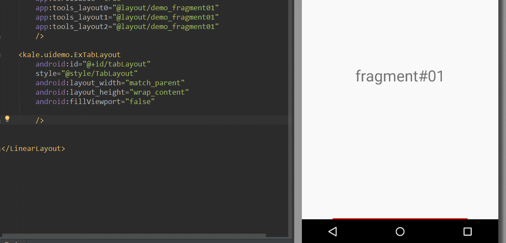   
这种修改原生控件支持预览的做法没什么高深的，大家可以用类似的思路去改造那些难以预览的控件。  


**3.7 通过插件来进行动态预览**  
我们都知道as的布局预览只支持静态预览，我们不能对预览界面进行交互，这样就无法测试滑动效果和点击效果了。所以我找到了[jimu mirror][1]这个插件来支持动态预览。启动mirror后，它会在你的手机上安装一个apk，这个apk展示的就是你当前的布局页面，mirror会监听xml文件的改动，如果xml文件发生了变化，那么它就能立刻刷新布局。下面来展示下我是如何在它的支持下预览viewpager的。   
1. 首先在viewpager中加入这段代码
```JAVA
    private void preview(Context context, AttributeSet attrs) {
        TypedArray a = context.obtainStyledAttributes(attrs, R.styleable.ExViewPager);
        List<View> viewList = new ArrayList<>();
        
        int layoutResId;
        if ((layoutResId = a.getResourceId(R.styleable.ExViewPager_tools_layout0, 0)) != 0) {
            viewList.add(inflate(context, layoutResId, null));
        }
        if ((layoutResId = a.getResourceId(R.styleable.ExViewPager_tools_layout1, 0)) != 0) {
            viewList.add(inflate(context, layoutResId, null));
        }
        if ((layoutResId = a.getResourceId(R.styleable.ExViewPager_tools_layout2, 0)) != 0) {
            viewList.add(inflate(context, layoutResId, null));
        }
        if ((layoutResId = a.getResourceId(R.styleable.ExViewPager_tools_layout3, 0)) != 0) {
            viewList.add(inflate(context, layoutResId, null));
        }
        if ((layoutResId = a.getResourceId(R.styleable.ExViewPager_tools_layout4, 0)) != 0) {
            viewList.add(inflate(context, layoutResId, null));
        }
        a.recycle();
        
        setAdapter(new PreviewPagerAdapter(viewList));
    }

    /**
     * @author Jack Tony 
     * 这里传入一个list数组，从每个list中可以剥离一个view并显示出来
     * @date :2014-9-24
     */
    public static class PreviewPagerAdapter extends PagerAdapter {
        private List<View> mViewList;

        public PreviewPagerAdapter(List<View> viewList) {
            mViewList = viewList;
        }

        @Override
        public int getCount() {
            return mViewList.size();
        }

        @Override
        public boolean isViewFromObject(View arg0, Object arg1) {
            return arg0 == arg1;
        }

        @Override
        public void destroyItem(ViewGroup container, int position, Object object) {
            if (mViewList.get(position) != null) {
                container.removeView(mViewList.get(position));
            }
        }

        @Override
        public Object instantiateItem(ViewGroup container, int position) {
            container.addView(mViewList.get(position), 0);
            return mViewList.get(position);
        }

    }
```  
上面的工作是为xml中设置viewpager中页面的layout做支持，以达到预览的作用。  
2. 编写xml布局文件
```XML
    <kale.uidemo.ExViewPager
        android:id="@+id/viewPager"
        android:layout_width="match_parent"
        android:layout_height="0dp"
        android:layout_weight="1.0"
        android:scrollbars="none"
        
        app:scrollable="true"
        app:tools_layout0="@layout/demo_fragment01"
        app:tools_layout1="@layout/demo_fragment02"
        app:tools_layout2="@layout/demo_fragment01"
        />
```  

最后运行插件即可看到效果：   
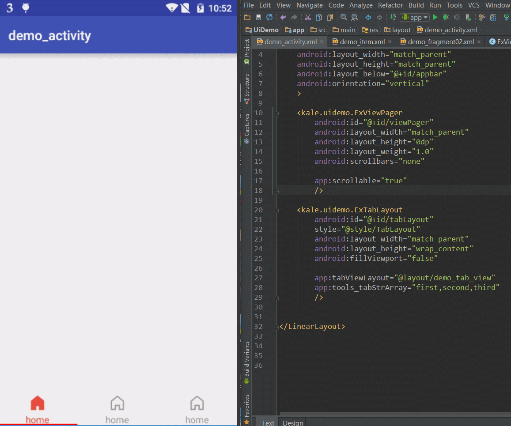   

### 四、快速预览插件  
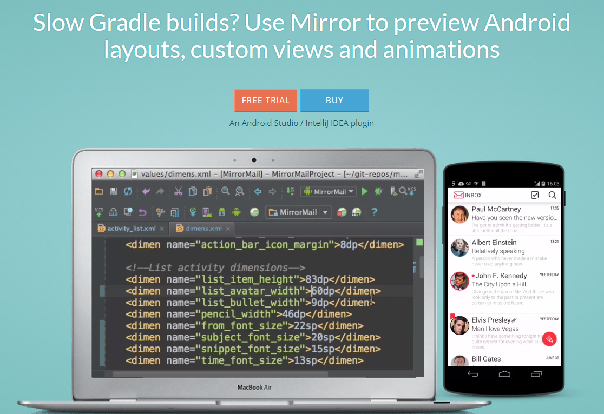  
上文提到了利用jimu mirror来做UI的实时预览，更多的预览技巧可以去他们的[网站][2]进行浏览。mirror做的是实时替换静态的xml文件，让开发者可以在真机中看到UI界面，感兴趣的朋友可以去试用体验版本的mirror。我在体验后感受到了它的强大和便捷，因为体验就几十天，所以我不得不成为了付费用户。其中最令人喜爱的是，他支持`tools`标签的属性并且支持力度强于as的实时预览器。   

  
与jimu mirror类似的，还有[jrebel][3]。这个东西更加强大，它做的不仅仅是让UI界面实时刷新，它甚至做到了让你更改java代码后就能实时替换apk中的类文件，达到应用实时刷新，我认为它是采用了热替换技术。官网的介绍是：Skip build, install and run，因此它可以节约我们很多很多的时间，它的效果也十分不错。  
jrebel和mirror的侧重点是不同的，它注重缩短应用整体的调试时间，走的仍旧是真机出结果的路线。而mirror目的是让开发者能实时预览UI，走的是UI独立测试的路线。总体来说这两款插件都挺不错的，这简直是给官方打脸啊。但因为jrebel太贵了，所以我还是推荐大家用mirror。

### 五、总结  
这篇文章确实挺长的，也花了很多功夫。我仍旧觉得官方在设计和优化IDE上程序员思维太重，给开发者带来的便利还是太少。`tools`标签一直没代码提示、官方的控件的可预览性不友好等问题也使得开发者很难快速地进行UI调试。在如今Android世界MVP、MVVM等模式大行其道的今天，UI独立测试变得尤为重要，我不希望大家每次调试UI还得安装运行一遍apk，更加不希望看到as的实时预览功能变成鸡肋。    
总之，感谢大家阅读到最后，如果你有其他的UI调试技巧请指出，如果你觉得本文提出的技巧有用，那么请尝试。   
祝愿大家，中秋快乐~

示例代码下载：[http://download.csdn.net/detail/shark0017/9142445](http://download.csdn.net/detail/shark0017/9142445)

### 作者  
     

developer_kale@.com  
@天之界线2010

  [1]: http://jimulabs.com/mirror-downloads/
  [2]: http://jimulabs.com/
  [3]: http://zeroturnaround.com/software/jrebel-for-android/
